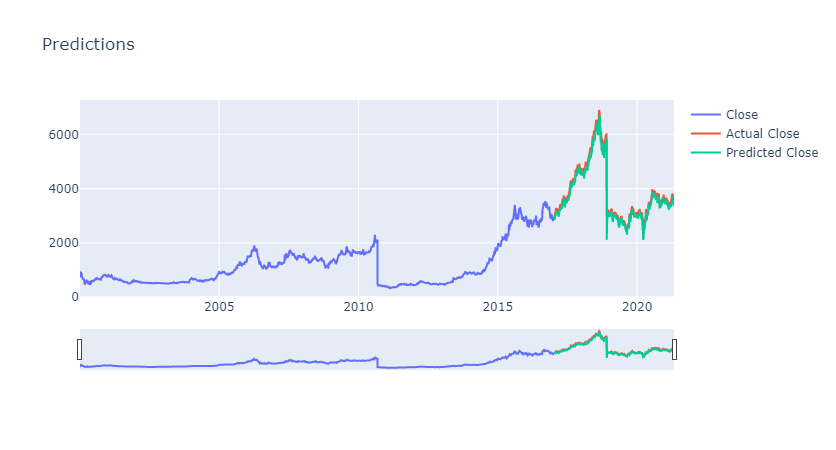

# **My Portfolio**

# Project 1: [Data Analysis of Red Wine](https://github.com/hansie23/data-analysis-of-red-wine)
* This code project is focused on the analysis and classification of red wine quality based on its chemical properties primarily using logistic regression.
* Used Python, Numpy, Pandas, Matplotlib, Seaborn and Scikit-Learn
* Found multi-colinearity in the data. Generated a 2-component PCA projection and visualization
* Trained and tested a logistic regression model gaining 98% accuracy
* Provided insights into how different features affect model performance and demonstrated techniques for visualizing and interpreting results.
* Covered essential steps in machine learning workflows, including data pre-processing, exploration, model training, evaluation, and feature selection
https://github.com/hansie23/Hansie-Kristi-Portfolio/blob/64944c99fd18d0d7065334a479e1bf3ce9d22f1c/images/pca.png

# Project 2 (Part 1): [Dog Breed Prediction Notebook](https://github.com/hansie23/dog-breed-prediction-notebook)
* Used Numpy, Pandas, Matplotlob, Scikit-learn, Tensorflow, Tensorflow Hub
* Turned images to tensors and then converted the data into batches
* Used the neural network model MobileNet V2 from Tensorflow Hub
* Created callbacks for Tensorboard and early stopping
* The model takes dog image as input and give the predicted dog breed as output.

# Project 2 (Part 2): [Dog Breed Prediction Webapp](https://github.com/hansie23/dog-breed-prediction-webapp)
* Used Flask, Python, HTML, CSS, Numpy, Heroku and Tensorflow
* Created a client facing web app to interact with the dog breed prediction model
* Created flask API for preprocessing and prediction of a dog image given as input
* [https://dogbreedprediction-webapp.herokuapp.com/](https://dogbreedprediction-webapp.herokuapp.com/) (might take a bit to load first
time since free Heroku web dyno sleeps after 30 minutes of no web traffic)

# Project 3: [Stock Price Prediction](https://github.com/hansie23/stock-prediction)
* Used Pandas, Numpy, Keras, Scikit-learn, Plotly, Matplotlib and Streamlit
* Designed a deep neural network using LSTM to predict the stock price

